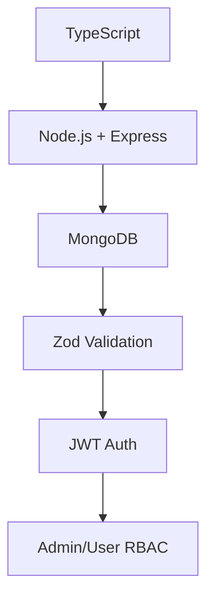

# 🎯 Lost & Found Backend System

**Production-ready Lost & Found platform backend** built with **TypeScript + Node.js + Express + MongoDB + Zod**. Supports Admin/User roles, JWT authentication, item claiming system, and dashboard analytics.

## ✨ **Features**

🚀 **Core Features:**
- ✅ **User Authentication** - JWT + bcrypt password hashing
- ✅ **Role-Based Access** - Admin & User permissions
- ✅ **Item Management** - CRUD operations with filtering/pagination
- ✅ **Smart Claiming** - Proof-based claim approval system
- ✅ **Admin Dashboard** - Analytics & claim management
- ✅ **Type Safety** - Full TypeScript implementation
- ✅ **Input Validation** - Zod schema validation
- ✅ **Production Ready** - Error handling, logging, security

## 🛠️ **Tech Stack**

| Frontend      | Backend           | Database | Tools      |
| ------------- | ----------------- | -------- | ---------- |
| React/Next.js | Node.js + Express | MongoDB  | TypeScript |
| Tailwind CSS  | TypeScript        | Mongoose | Zod        |
| Axios         | JWT Auth          |          | bcryptjs   |

🚀 Quick Start
Prerequisites
Node.js 18+ 
MongoDB 6.0+
npm/yarn

Clone & Install
bash
git clone https://github.com/tharsalan1/lost-found-backend.git
cd lost-found-backend
npm install

Environment Setup
bash
cp .env.example .env
# Update MongoDB URI, JWT_SECRET, PORT
npm run dev

.env Configuration
text
PORT=5000
MONGODB_URI
JWT_SECRET
NODE_ENV=development
CORS_ORIGIN

📁 API Endpoints
| Method | Endpoint             | Auth  | Description            |
| ------ | -------------------- | ----- | ---------------------- |
| POST   | /api/auth/signup     | No    | Create new user        |
| POST   | /api/auth/login      | No    | User login             |
| GET    | /api/items           | No    | List items (paginated) |
| POST   | /api/items           | Yes   | Create lost/found item |
| POST   | /api/items/:id/claim | Yes   | Submit claim           |
| GET    | /api/admin/dashboard | Admin | Admin analytics        |

Base URL: http://localhost:5000/api

🏗️ Project Structure
src/
├── config/          # Database, env config
├── models/          # Mongoose schemas
├── controllers/     # Request handlers
├── routes/          # API routes
├── middlewares/     # Auth, validation
├── services/        # Business logic
├── schemas/         # Zod validation
├── types/           # TypeScript interfaces
└── index.ts         # Server entry

📅 5-Day Development Roadmap
| Day   | Focus                            | Status    |
| ----- | -------------------------------- | --------- |
| Day 1 | ✅ Project Setup + MongoDB Models | COMPLETE  |
| Day 2 | ✅ Authentication + Middleware      | COMPLETE    |
| Day 3 | ✅ Item CRUD + Filtering            | COMPLETE |
| Day 4 | ✅ Claims + Admin Dashboard         | COMPLETE |
| Day 5 | ✅ Error Handling + Testing         | COMPLETE |

🧪 Testing
# Run tests
npm test

# Development with hot reload
npm run dev

# Build for production
npm run build
npm start

Postman Collection: postman/lost-found-api.json (coming soon)

🔐 Security Features
✅ JWT Authentication (7-day tokens)

✅ bcrypt Password Hashing (12 salt rounds)

✅ Zod Input Validation

✅ CORS Protection

✅ Rate Limiting Ready

✅ MongoDB Indexes

✅ SQL/XSS Injection Prevention

📊 Database Schema
erDiagram
    USER ||--o{ ITEM : posts
    USER ||--o{ CLAIM : claims
    ITEM ||--o{ CLAIM : has
    USER ||--|| ITEM : claims
    USER ||--|| CLAIM : approves

Collections: users, items, claims

🚀 Deployment
Vercel/Render

npm run build
# Set env vars in dashboard
npm start

🙌 Author
Mohd Arsalan
Full-Stack Developer | MERN Stack

⭐ Star this repo if it helps you!
